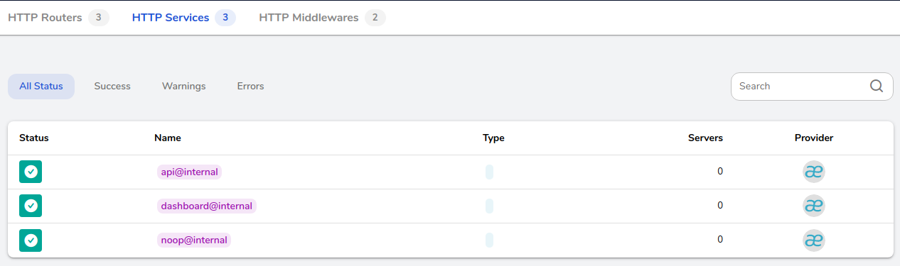
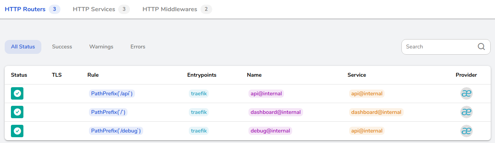
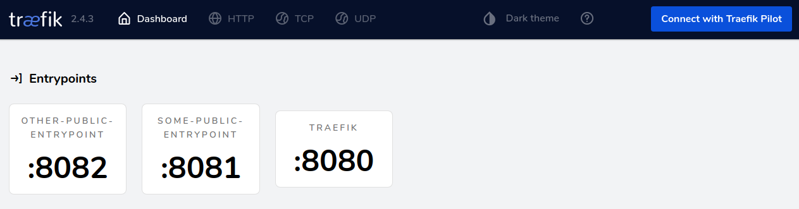
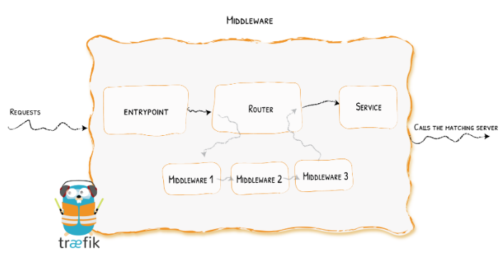
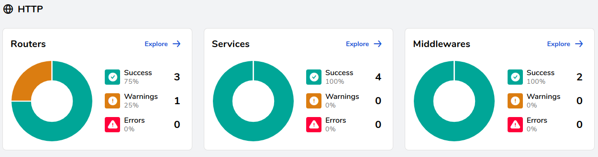
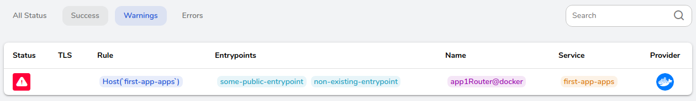
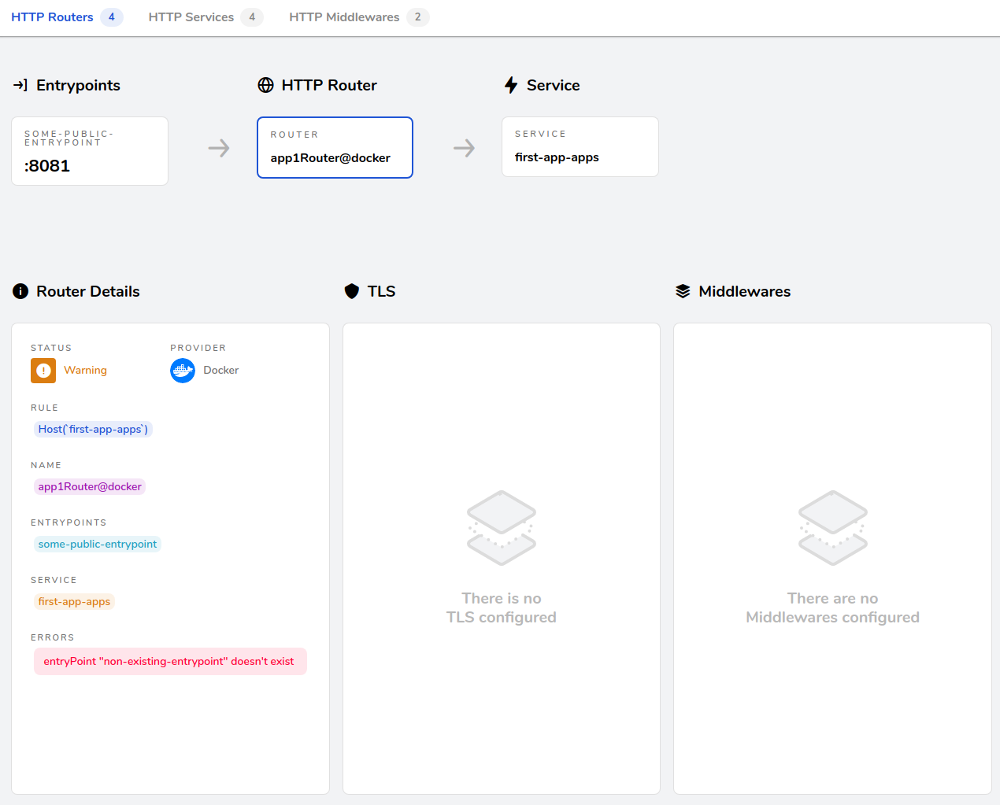
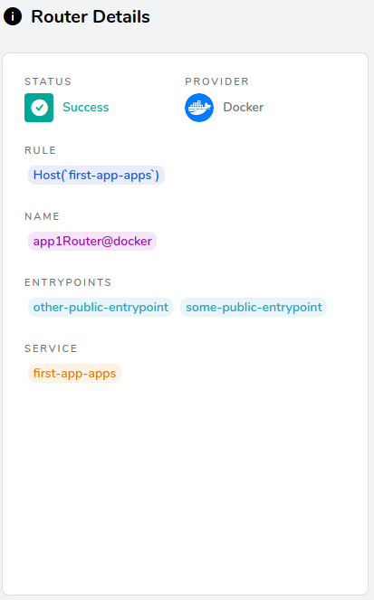

# Traefik tutorial

## Download Traefik binary

```sh
pushd . && \
cd traefik && \
wget https://github.com/traefik/traefik/releases/download/v2.4.3/traefik_v2.4.3_linux_amd64.tar.gz && \
tar -xvf traefik_v2.4.3_linux_amd64.tar.gz && \
rm LICENSE.md CHANGELOG.md traefik_v2.4.3_linux_amd64.tar.gz && \
popd
```

## Start Traefik

Execute the Trafic binary and specify the **static** configuration file:

```sh
./traefik/traefik --configfile traefik/config/static.yml
```

*Note*: every time you make a change to the **static** configuration, you need to stop and restart Traefik. On the other hand, there is no need to stop and restart Trafik when you change the dynamic configuration.

Now the Trafik API is available directly on the entryPoint named `traefik`, because we set `api.insecure=true` in `traefik/config/static.yml`. Test that the API is responding by querying some endpoint. For example:

```sh
curl http://localhost:8080/api/overview
```

Also, additional debug endpoints are available, because we set `api.debug=true` in `traefik/config/static.yml`.

```sh
curl http://localhost:8080/debug/vars
```

## Explore the Traefik dashboard

The Traefik dashboard is available at `http://localhost:8080/dashboard/#/`, because we set `api.dashboard=true` in `traefik/config/static.yml` (and also `api.insecure=true`, because otherwise the dashboard would be more difficult to setup).

At this point, only 3 **services** are found by Traefik:

1. api@internal
2. dashboard@internal
3. noop@internal

Note that these 3 **HTTP Services** have no corresponding **Servers** and they have Traefik itself as the **Provider**.



There are also 3 **HTTP Routers** that listen to the `traefik` **Entrypoint**, apply some **Rules**, and map the entrypoint to a **HTTP Service**. In Traefik there are also **TCP Routers** that map to **TCP Services**, and **UDP Routers** that map to **UDP Services**.



You can see the Traefik entrypoints in the dashboard home:



If you need more details, you can also query the Traefik REST API:

```sh
curl http://localhost:8080/api/entrypoints
curl http://localhost:8080/api/entrypoints/some-public-entrypoint
```

Traefik Middlewares modify an incoming request before the request is routed to the appropriate service. You can combine Traefik middlewares in a [Chain](https://doc.traefik.io/traefik/v2.0/middlewares/chain/) of middlewares (and eventually chaining those middleware chains too).



## Spin up the first service

Now we will use docker-compose to spin up two Node.js apps and the whoami app described in the [Traefik quick start](https://doc.traefik.io/traefik/getting-started/quick-start/).

Here is the structure of the `apps` directory:

```sh
.
├── docker-compose.yml
├── node-app-one
│   ├── Dockerfile
│   ├── package.json
│   └── server.js
└── node-app-two
    ├── Dockerfile
    ├── package.json
    └── server.js
```

Let's spin up only one Node.js, the service named `first-app`:

```sh
cd apps
docker-compose up -d --remove-orphans first-app
```

Traefik is able to find the container we have just started because it performs an **automatic service discovery**. By default Traefik, when using the [Docker Provider](https://doc.traefik.io/traefik/providers/docker/), will find **all** the containers on your Docker host. But since this is not what I wanted, I set `exposedByDefault = false` in `traefik/config/static.yml`. This means that Traefik will not discover a container unless we set a Docker label of `traefik.enable=true` for that particular container.

So, before we had 3 services and 3 routers. Now we have 4 services, but only 3 routers and a warning. What's going on? Let's click on **Routers** to understand what's wrong with our configuration.



From the list of Traefik Routers that have some warnings, we can see that the `app1Router@docker` (where `@docker` indicates the Traefik Provider) have 2 Entrypoints, `some-public-entrypoint` and a suspect `non-existing-entrypoint`.



If we click on that, we can also see a more detailed page:



Traefik is telling us that we misconfigured one of the two entrypoints of this Router.

Now, which Traefik configuration do you think we have to change, in order to get rid of this warning? The static configuration? Or the dynamic one?

TODO: write a more detailed explanation

Well, it's the dynamic configuration. Since we are using the Docker provider to expose the `first-app` service to Traefik, the dynamic configuration is defined in the [Docker label](https://docs.docker.com/config/labels-custom-metadata/) for this container. Here is the relevant section in the `docker-compose.yml`:

```text
services:
  first-app:
  labels:
      - "traefik.enable=true"
      - "traefik.http.routers.app1Router.entrypoints=some-public-entrypoint,non-existing-entrypoint"
```

TODO: explain difference when `swarmMode: true` vs when `swarmMode: false`

In order to get rid of the warning, we have several options:

1. remove `non-existing-entrypoint` from `traefik.http.routers.app1Router.entrypoints`
2. replace `non-existing-entrypoint` in `traefik.http.routers.app1Router.entrypoints` with an existing entrypoint, for example `other-public-entrypoint`
3. define the entrypoint `non-existing-entrypoint` in the `traefik/config/static.yml` file, then stop and restart Traefik

Options 1 and 2 involve stopping the `first-app` service and restart it, while Traefik can stay up.

Option 3 involves stopping both the `first-app` service and Traefik.

Lets' go for option 2 and modify the label in `apps/docker-compose.yml`

```sh
cd apps
docker-compose stop first-app
docker-compose up -d first-app
```

As you can see, the warning is now gone:


